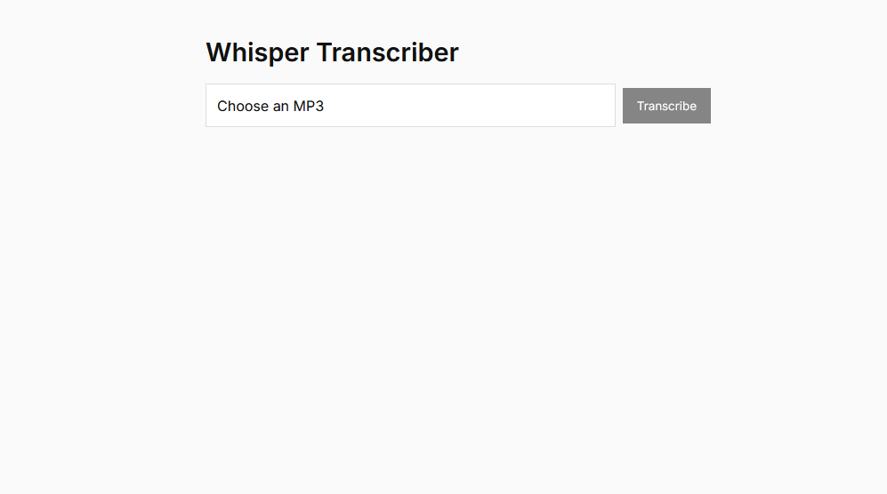

# Whisper Transcriber 🗣️➡️📜

Minimal, clean web app that turns an **uploaded MP3** into plain‑text using OpenAI Whisper on your **local GPU**.

| Stack | Version |
|-------|---------|
| **Backend** | Python 3.10 + [FastAPI] |
| **Model** | [openai‑whisper] (runs on CPU or CUDA GPU) |
| **Frontend** | React 18 + [Vite] |
| **Dev server ports** | 8000 (backend) & 5173 (frontend) |

---

## ✨ Live demo screenshot

 <!-- optional -->

---

## 🔧 Quick start

### 1 · Clone & cd

```bash
git clone https://github.com/<you>/whisper-transcriber.git
cd whisper-transcriber
```

### 2 · Backend (setup once)

```bash
python -m venv .venv        # create local venv
source .venv/bin/activate   # Windows: .venv\Scripts\activate
pip install -r backend/requirements.txt
```

### 3 · Frontend (Node ≥ 18)

```bash
cd frontend
npm install        # grabs React/Vite deps
```

### 4 · Run in dev mode (two terminals)
```bash
# —— terminal 1 ——
source .venv/bin/activate
python backend/main.py       # http://localhost:8000

# —— terminal 2 ——
cd frontend
npm run dev                  # http://localhost:5173
```

Open http://localhost:5173, upload an MP3, click Transcribe → watch the text appear.

# 🛠️ Production build (optional)
```bash
# Build static assets
cd frontend
npm run build          # outputs to dist/

# Serve with any static host or use Vite preview
npm run preview
```

For a full SPA + API deployment (e.g. Docker, Fly, Render), bundle:
1. ```uvicorn backend.main:app```
2.  Static ```frontend/dist``` files served by nginx or FastAPI’s ```StaticFiles```.

# 🚀 Roadmap

- ⬜ Drag‑and‑drop uploads

- ⬜ Persistent transcript history (SQLite)

- ⬜ Dark/light theme toggle

- ⬜ Selectable Models (tiny, base,small,medium,large,turbo)