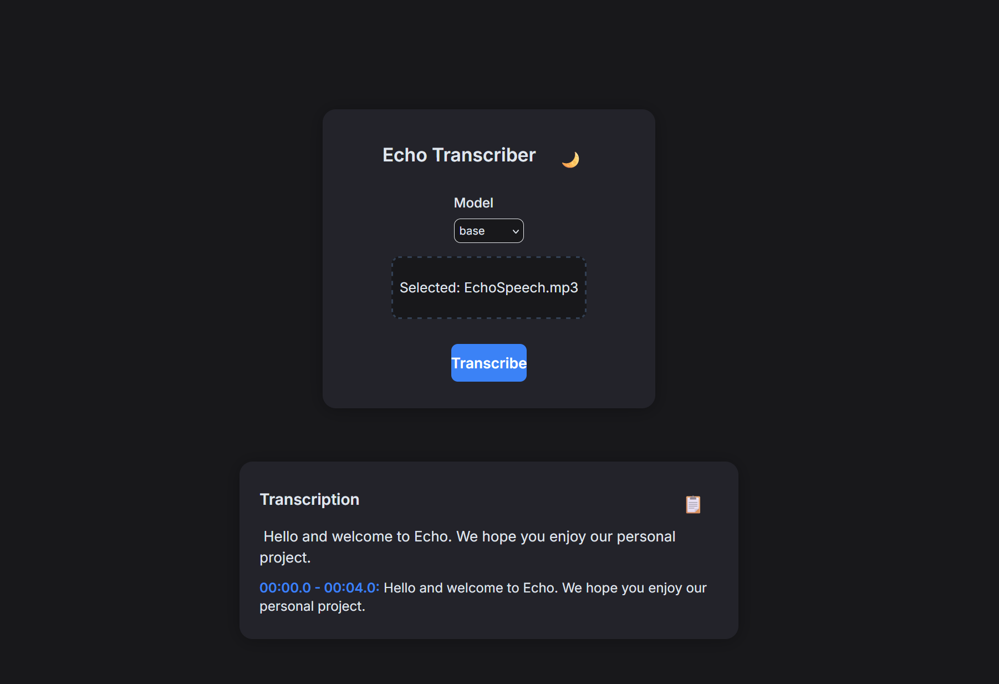

# Echo

A minimal, fast, and modern web app for transcribing audio files using OpenAI’s Whisper models on your own GPU.

---
## Live Demo Screenshot



---
## Features

- 🎙️ **Audio transcription:** Upload or drag-and-drop an audio file (mp3, wav, m4a, flac, ogg) and get instant transcriptions.
- 🚀 **Runs locally:** No cloud cost or privacy concerns—everything runs on your own GPU.
- 🌙 **Dark mode (default):** Toggleable dark/light theme for comfortable use.
- 🏷️ **Multi-model selection:** Pick from all major Whisper models (tiny, base, small, medium, large, etc.).
- 📦 **Drag-and-drop support:** Fast, easy, and intuitive uploads.
- 🧩 **Responsive UI:** Works well on desktop and mobile.
- 🔎 **Clear error handling:** Get helpful feedback if something goes wrong.
- 🧮 **Modern tech:** FastAPI backend, React frontend.
- 📋 **Copy to clipboard:** Quickly copy transcription results with a dedicated button.
- ⏱️ **Timestamped transcription segments:** View the timestamp for each segment of the transcription.
- 🔔 **Toast notifications:** Visual feedback for file selection, transcription completion, and errors.
- 🐳 **Dockerized deployment:** Easily run the entire app in a container.

---

# Getting Started

## Prerequisites

- Python 3.9+ (with PyTorch and CUDA for GPU acceleration)
- Node.js (for building the frontend, if not using Docker)

### Setup (Backend)

```bash
cd backend
python -m venv venv
source venv/bin/activate  # On Windows: venv\Scripts\activate
pip install -r requirements.txt
# (If PyTorch is not installed via requirements, install it separately as needed)
python main.py
```

### Setup (Frontend)

```bash
cd frontend
npm install
npm run dev
```

> By default, the frontend expects the backend at `http://localhost:8000`.

---

# API

## `POST /transcribe`

- **Body:** `multipart/form-data`
    - `file`: Audio file to transcribe
    - `model_name` (optional): Whisper model (`tiny`, `base`, etc.; default is `base`)
- **Response:**  
    - `{ "text": "Transcribed text...", "segments": [ { "start": 0.0, "end": 5.2, "text": "Segment text..." }, ... ] }`
- **Errors:**  
    - `{ "error": "Descriptive message..." }`

> Note: The `/transcribe` endpoint is rate-limited to 5 requests per minute per IP to prevent abuse.

## `GET /health`

- **Response**: `{ "status": "ok" }`
- **Purpose**: Simple health check endpoint (useful for monitoring or load balancers).

**API Documentation**: Interactive API docs are available at the built-in Swagger UI `(/docs)` and Redoc `(/redoc)` endpoints when the server is running.

---

# Docker

```bash
docker build -t echo .
docker run -p 8000:8000 --gpus all echo
```
The app will be available at http://localhost:8000. The React frontend is served on the same port, and the FastAPI endpoints (e.g. /transcribe, /health) are accessible under the same base URL. The --gpus all flag is optional (use it if you have an NVIDIA GPU and NVIDIA Docker configured to enable GPU acceleration inside the container).

# Testing

The testing dependencies (`pytest` and `requests`) are included in `backend/requirements.txt`. To run the automated tests, ensure you have installed all dependencies:

```bash
cd backend
# source venv/bin/activate (if you use a virtual environment)
pip install -r requirements.txt 
# Then, from the root directory of the project:
pytest
```
This will run the test suite, which covers the health endpoint, transcription (using a dummy model for speed), invalid model handling, and rate limiting.

# 🚀 Roadmap

## ✅ Completed

- [x] **Dark mode** as default, with toggle button.
- [x] **Multi-model selection** in UI and backend.
- [x] **Drag-and-drop** file upload support.
- [x] **Client-side file validation** (type/size).
- [x] **Async backend endpoint** with model caching for fast, concurrent requests.
- [x] **Clear inline error handling** for common issues.
- [x] **Responsive UI** for mobile/desktop.

## 🚧 Planned / Ideas

- [x] Display timestamps and segments from transcription.
- [x] Copy-to-clipboard button for results.
- [x] Server-side rate limiting and abuse protection.
- [x] Toast notifications for upload/result.
- [x] Dockerization for simple deployment.
- [x] Healthcheck endpoint for backend.
- [x] API docs and improved usage guides.
- [x] Automated tests.